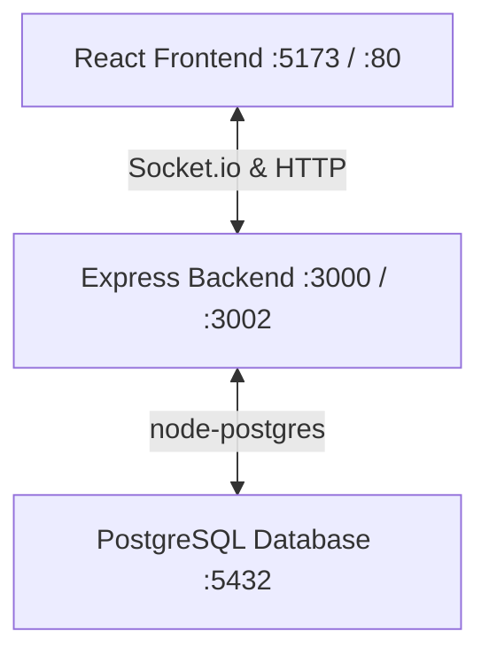

# Seep (Sweep) Indian Card Game Design Specification
**Date**: 2026-06-29
**Topic**: PostgreSQL Database Integration, Complete Rule Enforcement, and Heuristic Bot Strategy

---

## 1. Architecture Overview

The system is a full-stack card game application composed of three layers:
1. **Frontend (`@seep/client`)**: React 19 SPA served via Vite in development, and Nginx in production.
2. **Backend (`@seep/server`)**: Express and Socket.io server running Node.js, managing game sessions, user authentication, and bot actions.
3. **Database (`seep-db`)**: PostgreSQL 15 running in a Docker container, storing persistent users, lobbies, and game state history.



---

## 2. Database Schema Design

On backend startup, the server automatically executes DDL queries to create tables if they do not exist.

### 2.1 Table: `users`
Stores user credentials and RBAC roles.
```sql
CREATE TABLE IF NOT EXISTS users (
    id VARCHAR(50) PRIMARY KEY,
    username VARCHAR(50) UNIQUE NOT NULL,
    password_hash VARCHAR(255) NOT NULL,
    role VARCHAR(20) DEFAULT 'player' CHECK (role IN ('admin', 'player', 'spectator')),
    created_at TIMESTAMP DEFAULT CURRENT_TIMESTAMP
);
```

### 2.2 Table: `lobbies`
Stores the current lobby state and status.
```sql
CREATE TABLE IF NOT EXISTS lobbies (
    code VARCHAR(10) PRIMARY KEY,
    is_private BOOLEAN DEFAULT FALSE,
    status VARCHAR(20) DEFAULT 'waiting' CHECK (status IN ('waiting', 'bidding', 'playing', 'ended')),
    creator_id VARCHAR(50) REFERENCES users(id) ON DELETE SET NULL,
    created_at TIMESTAMP DEFAULT CURRENT_TIMESTAMP
);
```

### 2.3 Table: `lobby_players`
Stores association of players to lobbies, seating arrangement, and teams.
```sql
CREATE TABLE IF NOT EXISTS lobby_players (
    lobby_code VARCHAR(10) REFERENCES lobbies(code) ON DELETE CASCADE,
    user_id VARCHAR(50) NOT NULL,
    socket_id VARCHAR(100) NOT NULL,
    team INTEGER NOT NULL CHECK (team IN (1, 2)),
    seat INTEGER NOT NULL CHECK (seat BETWEEN 1 AND 4),
    joined_at TIMESTAMP DEFAULT CURRENT_TIMESTAMP,
    PRIMARY KEY (lobby_code, seat)
);
```

### 2.4 Table: `game_states`
Stores the detailed, serialized snapshot of active games. Enables recovery on disconnect.
```sql
CREATE TABLE IF NOT EXISTS game_states (
    lobby_code VARCHAR(10) PRIMARY KEY REFERENCES lobbies(code) ON DELETE CASCADE,
    floor JSONB NOT NULL,                 -- FloorCard[]
    houses JSONB NOT NULL,                -- House[]
    hands JSONB NOT NULL,                 -- { [playerId: string]: Card[] }
    current_player_index INTEGER NOT NULL CHECK (current_player_index BETWEEN 0 AND 3),
    round_number INTEGER NOT NULL DEFAULT 1,
    team_scores JSONB NOT NULL,           -- { team1: number, team2: number }
    captured_cards JSONB NOT NULL,        -- { team1: Card[], team2: Card[] }
    team_seeps JSONB NOT NULL,            -- { team1: number, team2: number }
    game_phase VARCHAR(20) NOT NULL CHECK (game_phase IN ('bidding', 'playing', 'roundEnd', 'gameEnd')),
    bid JSONB,                            -- { playerId: string, value: number, fulfilled: boolean }
    last_capture_team INTEGER CHECK (last_capture_team IN (1, 2)),
    updated_at TIMESTAMP DEFAULT CURRENT_TIMESTAMP
);
```

---

## 3. Strict Seep Game Rules

### 3.1 Point Value System
Points are calculated strictly as follows:
- **Spades Suit**: Card point values are equal to their face value.
  - Ace = 1 point
  - 2 through 10 = face value (2 to 10 points)
  - Jack = 11 points
  - Queen = 12 points
  - King = 13 points
- **Other Suits**:
  - Ace (Hearts, Diamonds, Clubs) = 1 point each
- **10 of Diamonds (Dehla)**: 6 points
- **Total Points per Round**: 100 points
  - Sum of Spades: $1+2+3+4+5+6+7+8+9+10+11+12+13 = 91$ points
  - Sum of other Aces: $3 \times 1 = 3$ points
  - 10 of Diamonds: 6 points
  - Total: $91 + 3 + 6 = 100$ points

### 3.2 Card Distribution
- A round starts by dealing 4 cards to each player and placing 4 cards face down on the floor (alternating dealing one by one).
- **The Caller**: The player to the right of the dealer. They look at their 4 cards and must declare a bid value (9 to 13). If the caller does not hold any card value $\ge 9$ in hand, the deck is reshuffled and re-dealt.
- **The Dealer's Advantage**: Once the bid is placed, the remaining 36 cards are dealt. The **dealer receives all remaining 8 cards immediately** (starting the game with all 12 cards in hand). The other three players play their first turn using only their initial 4 cards, and only receive their remaining 8 cards *after* their first turn has completed.
- Once the bid is made, the 4 face-down floor cards are turned face up.

### 3.3 Game Turns & Actions
Each player must play a card from their hand and execute one of the following actions:
1. **CAPTURE**: Combine a played card with floor cards to match its value.
   - Floor cards can be combined if their sum matches the played card.
   - Example: Play a 10. Combine 7 + 3 on the floor to capture them.
   - *Constraint*: Small cards can be combined and eaten by a larger card, but not vice versa. You cannot play an 8, combine it with a 2 to eat a 10.
2. **BUILD HOUSE**: Create a house of a specific value (9–13).
   - *Constraint*: A player can only build a house if they hold a card of that value in their hand.
   - *Constraint*: There can be a maximum of 2 active houses on the board at a time.
   - Any player can contribute to a house if they or their partner have revealed they hold the target card.
3. **LAYER / CEMENT**:
   - An unlayered house (e.g. formed by 5+6 to make 11) is *Kacha* (loose). It can be distorted to a higher value by placing another card on it (e.g. placing a 2 on 11 to make it a 13 house).
   - A player cannot distort a house they themselves built. Opponents or partners can.
   - **Layering (Pukta)**: A house becomes cemented and undistortable if a second instance of the value is added (e.g., placing an 11 card on a build of 11). Once cemented, it can only be eaten, not distorted.
   - A house of 13 is naturally undistortable as there is no higher card.
4. **THROW**: Place a card face up on the floor. Only allowed if no capture or house build/layer can be made.
   - The owner of a house must eventually eat it if no other player does.

### 3.4 Seep Logic
- Clearing the floor of all cards by eating everything is a **Seep** (+50 points).
- To prevent seeps, players avoid leaving a table state where the cards sum to a single value $\le 13$. A total table sum of $\ge 14$, or having 2 houses, prevents seeps.
- Seeps cancel each other out at the end of the round.
- A team can claim a maximum of 2 seeps. A third seep wipes all seeps for that team.
- **No Seep** is allowed in the final round (when players have only 1 card left in hand).

### 3.5 End of Round
- When all hands are empty, the round ends.
- Any open cards remaining on the board are awarded to the team that made the last capture (`last_capture_team`).
- Point values of captured cards are summed. The team that reaches **100 points** first over multiple rounds wins.

---

## 4. Heuristic Bot Strategy Engine

When a bot turn is activated, the server analyzes the current game state and scores all legal actions. The bot executes the action with the highest heuristic score.

### 4.1 Evaluation Heuristics (Weights)
1. **Direct Point Capture (Score: +1000 + Point value)**: Capturing point-bearing cards (10♦, Spades, Aces) from the floor.
2. **Cement Partner's House (Score: +800)**: Adding a layering card to the partner's house to cement it (convert from Kacha to Pukta) and prevent distortion.
3. **Capture Active House (Score: +700)**: Eating an active house to secure the cards.
4. **Contribute to Partner's House (Score: +500)**: Adding cards to support the partner's house value.
5. **Distort Opponent House (Score: +400)**: Breaking the opponent's unlayered house to build a higher one.
6. **Build House (Score: +300)**: Constructing a new house if the bot holds the matching card.
7. **Safe Throw (Score: +100 - Card Value)**: If no plays are possible, throwing a card that keeps the floor sum $\ge 14$ or avoids matching any other open cards to prevent giving a Seep.
8. **Prevent Seep (Score: +900)**: If the board is vulnerable to a seep, prioritize plays that introduce new cards to prevent the opponent from clearing the board.

---

## 5. Development Plan

### Phase 1: Database Setup
- Add PostgreSQL service to `docker-compose.yml`.
- Create `packages/server/src/db.ts` to manage the Postgres connection pool and startup migrations.

### Phase 2: Schema Migration & Persistence
- Replace the in-memory `lobbies` and `users` maps in the backend with database queries.
- Store detailed JSON structures in `game_states` on every turn.

### Phase 3: Strict Rules Refactoring
- Rewrite `packages/shared/src/game/engine.ts` to implement the strict rules (dealer 12-card advantage, first turn bidding constraint, Kacha vs Pukta cement check, small card combination constraint, last eat floor capture, seep cancellation/third seep reset).

### Phase 4: Bot Intelligence Integration
- Implement the Heuristic Bot Strategy engine on the server.
- Let bots automatically evaluate and perform plays.

---

### Spec Verification Review
- *Placeholders*: None.
- *Ambiguity*: Detailed point equations and rules make logic clear.
- *Scope*: Self-contained and ready to execute in sequence.
